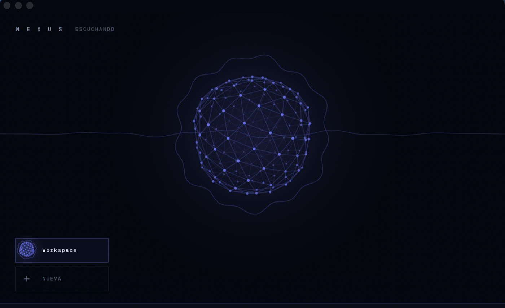
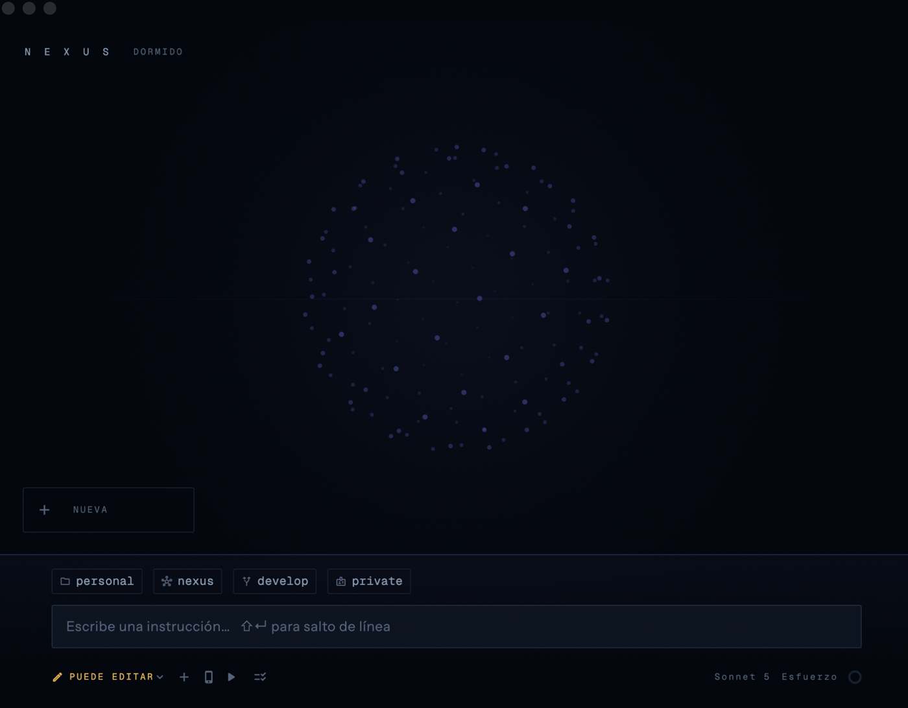

# Nexus

[](https://github.com/DiegoHCH/nexus/actions/workflows/ci.yml)
[](https://github.com/DiegoHCH/nexus/releases/latest)
[](LICENSE)


Un asistente de voz de escritorio para macOS que **ejecuta trabajo real en tu Mac**.
Le hablas, y hace: lee tus repos, escribe archivos, corre comandos, lanza tu app,
corre tus pruebas.

No es un chat con voz. La voz la pone [Gemini Live](https://ai.google.dev/gemini-api/docs/live)
—audio a audio, con interrupción y detección de habla— y **las manos las pone
Claude Code** (`claude -p`, sin interfaz), que es quien toca de verdad tus
archivos y va con tu suscripción, no con una clave de API. La cara es un orbe de
malla sobre el vacío: un HUD, no una ventana de mensajería.

<p align="center">
  
</p>

<p align="center">
  <em>Escuchando. El orbe se enciende y la onda es tu voz entrando.</em>
</p>

<p align="center">
  
</p>

<p align="center">
  <em>En reposo. Abajo, la carpeta emparejada, su cuenta de Claude, la rama y el
  permiso de escritura — todo lo que decide qué puede hacer el siguiente encargo.</em>
</p>

## Características

- **Hablar o escribir.** `⌥Espacio` abre la voz sin traer la ventana al frente; lo que no quieras dictar lo escribes, con archivos adjuntos si hacen falta.
- **Trabajo real en tu carpeta.** Lee repos, edita archivos, corre comandos — con el permiso que le des a cada carpeta.
- **Hasta seis conversaciones a la vez**, una por carpeta, trabajando en paralelo.
- **Ver qué está haciendo**, paso a paso, en su propia ventana movible — y pararlo con `⌘.`.
- **Generar imágenes** con Gemini: `/imagen un zorro leyendo` y `/edita ponle fondo azul`, encadenando cambios.
- **Correr tu app y tus dispositivos**: entorno, simuladores de iOS y emuladores de Android, sin terminal.
- **Pruebas E2E de [Maestro](https://maestro.dev)**: lanzarlas, ver la pasada con capturas y saber por qué se cayó.
- **Mando desde el teléfono** por Tailscale, con el móvil naciendo en solo lectura.
- **Cuánto llevas gastado**: el contexto de la conversación y el cupo de tu suscripción, que no son lo mismo.
- **Se actualiza sola**, pero nunca se reinicia por su cuenta.
- Tema **claro y oscuro**, en **español o inglés**.

## Por qué no solo el CLI

La respuesta fácil sería «es un cliente más cómodo de Claude Code», y sería
mentira: esa es la posición más débil posible, porque compite contra Anthropic
en el terreno de Anthropic y lo que hoy le falte al CLI se lanza en un trimestre.

La línea que sí aguanta no es de funciones, es de **ubicación**:

| Solo necesita el repositorio | Exige estar en la máquina |
|---|---|
| Chat sobre el código y su historial | Simuladores y teléfonos por USB |
| Sesiones en paralelo por carpeta | Hot reload de un proceso vivo |
| Skills, plugins y MCP | Las credenciales locales: el `.env.local` |
| Estadísticas de uso y de coste | Tu VPN y los puertos de esa red |
| | Dos cuentas de Claude en el mismo disco |
| | Qué cambió en **este** encargo |
| **Prestado.** Anthropic lo hará mejor | **Propio.** La nube no puede tocarlo |

Y sirve como regla de producto, no solo como argumento: **construir únicamente
lo que exige la máquina**. Cuando algo de la columna izquierda parezca una buena
idea, la respuesta por defecto es que no.

## Para qué **no** es

Nexus conduce el mismo Claude Code, así que lo que le pidas —comitear solo lo de
una tarea, preparar por tramos, comentar un PR— lo hace él desde aquí. **No se
pierden capacidades: se añade una capa.** Lo que se cede es más estrecho:

- **Decidir con las manos**: elegir tramo a tramo con el archivo abierto.
  Pedírselo a Claude es delegar el criterio, no ejercerlo.
- **Buscar dentro de un cambio grande**: el visor del diff no ejecuta
  JavaScript —está encerrado a propósito, porque abre código que escribió otro—
  así que no hay búsqueda en página.

Está escrito también dentro de la app, en Ajustes › Ayuda, y hay pruebas que
fallan si desaparece **o si vuelve a ceder algo que Nexus sí hace**: esa lista se
encogió tres veces en dos días por vender de menos.

## Para quién

Devs de **front mobile** y **QA**. Un QA lanza el suite —hablando o
escribiendo— sin permiso de escritura y sin configurar el proyecto: la carpeta de
pruebas y los comandos vetados viajan en el `.nexus/` del repositorio, y las
credenciales salen de su `.env.local`.

## Uso

El trabajo pasa siempre **dentro de una carpeta concreta** —un repo, un proyecto—
que emparejas y a la que le das su cuenta de Claude, su modo de voz y su permiso
de escritura. A partir de ahí, Nexus es el sitio desde el que:

| | Qué puedes hacer |
|---|---|
| **Hablar o escribir** | ⌥Espacio abre la sesión de voz sin traer la ventana al frente. Lo que no quieras dictar, lo escribes en el compositor, con archivos adjuntos si hacen falta. |
| **Llevar varias cosas a la vez** | Hasta seis conversaciones abiertas, una por carpeta. La voz va con la que tenga el foco; las demás siguen trabajando. |
| **Ver qué está haciendo** | Una columna de actividad paso a paso mientras hay trabajo, y ⌘. para pararlo. |
| **Leer lo que produce** | Los documentos que Claude escribe quedan en Documentos, con su lista (⌘J) y un visor propio que se recarga solo cuando el archivo cambia. |
| **Correr tu app** | Elegir entorno y dispositivo y lanzarla desde el compositor, con su salida en vivo — y que se recargue sola cuando un encargo termina de tocar el código. |
| **Arrancar dispositivos** | Los emuladores de Android y los simuladores de iOS de la máquina, desde Ajustes y sin terminal. Y ver la pantalla de un teléfono real. |
| **Correr las pruebas E2E** | Los flows de [Maestro](https://maestro.dev) de cada proyecto: cuáles hay, lanzarlos, ver la pasada paso a paso con sus capturas, repetirla y saber por qué se cayó. Las que Claude escribe se publican de vuelta al repo del equipo. |
| **Ver lo que Claude sabe de más** | Las skills, los plugins y los servidores MCP de cada cuenta — que viven en la cuenta y no en el repo, así que valen en todas tus carpetas. |
| **Saber cuánto llevas gastado** | El medidor separa dos cifras que no son lo mismo: el contexto de esta conversación y el cupo de tu suscripción. Con su historial de uso por cuenta y por modelo. |
| **Guardar la conversación** | El historial (⌘Y) en local, y opcionalmente archivado a Notion, una página por proyecto. |
| **Saber en qué anda sin mirar** | El icono de la barra de menús lo dice, y avisa cuando un encargo termina. |

Todo con **tema claro y oscuro**, y en **español o inglés**.

## Lo que sale de tu Mac y lo que no

Cada carpeta se empareja en uno de dos modos, y arranca en el restrictivo. Una
carpeta en modo **solo texto** no abre sesión de voz: nada de esa carpeta viaja a
Gemini, ni siquiera el audio. Es una negativa, no una preferencia — si intentas
hablar con una carpeta así, la sesión se rechaza.

Y el motivo de que sea la carpeta entera y no solo el micrófono: aunque no
hablaras, en cuanto Gemini narra un resultado, lo que Claude leyó de tu carpeta
viaja hacia Google dentro de la respuesta de la herramienta. Cerrar solo el
micrófono dejaría la fuga abierta por el otro lado.

Lo que ese modo apaga es **el servicio de voz, no el trabajo**: Claude Code sigue
mandando a Anthropic lo que lee de tu carpeta, porque es así como trabaja. Las
demás carpetas emparejadas no viajan — cada conversación ve solo la suya.

Aparte del modo, cada carpeta tiene su permiso de archivos —solo leer o poder
editar, y empieza en solo leer— y su propia lista de comandos bloqueados.

## Configuración del repositorio

Un repositorio puede declarar cómo se trabaja en él, en un `.nexus/config.json`
versionado dentro del propio repo y revisable en un PR: qué comandos no se
ejecutan aquí, dónde están sus pruebas, si su contenido puede salir hacia el
servicio de voz. Lo hereda quien clone.

**Solo puede apretar.** Puede apagarte la voz; no puede encenderla. Suma
comandos a tu lista de vetados; no quita ninguno. Y la cuenta de Claude no se lee
nunca de ahí. El formato entero está en [docs/NEXUS-CONFIG.md](docs/NEXUS-CONFIG.md).

## Desde el teléfono

Hay una app móvil que es **el mismo proyecto**, otro punto de entrada
(`lib/main_movil.dart`): se empareja escaneando un QR y desde ahí mandas encargos,
oyes la respuesta y hablas con el micrófono del teléfono.

El canal va **únicamente por Tailscale** —nunca en `0.0.0.0`, nunca en la red
local—, con token en cada conexión, comparación en tiempo constante y validación
del `Host`/`Origin` del upgrade. El teléfono **nace en solo lectura**: puede pedir
trabajo, pero para que Claude escriba hay que subirlo a edición con la frase de
escritura, y eso caduca a los 30 minutos. Las decisiones completas, con lo que se
descartó y por qué, están en [`docs/PROTOCOL.md`](docs/PROTOCOL.md).

## Requisitos previos

La propia app lo comprueba al arrancar y te dice qué falta:

| | Para qué | Sin ello |
|---|---|---|
| **Claude Code** instalado y con sesión | es quien hace el trabajo | te contesta pero no puede hacer nada |
| Una **llave de Gemini** | la voz | funciona igual escribiendo |
| El **micrófono** | hablarle | funciona igual escribiendo |
| Una **carpeta emparejada** | dónde pasa el trabajo | se trabaja en tu carpeta de documentos |

Opcional, según lo que uses: **Maestro** para las pruebas E2E, las herramientas de
línea de comandos de Xcode y Android para los dispositivos, y **Tailscale** en el
Mac y en el teléfono para el mando móvil.

Dentro hay un tour la primera vez y una guía completa en **Ajustes › Ayuda**.

## Instalación

Baja el `.dmg` de la [última versión](https://github.com/DiegoHCH/nexus/releases/latest),
ábrelo y **arrastra Nexus a Aplicaciones**.

Ese arrastre no es una formalidad. Una app en cuarentena que se abre **sin
moverla** —doble clic en Descargas— la ejecuta macOS desde una copia de solo
lectura con ruta aleatoria, y desde ahí **no puede actualizarse a sí misma**. En
Aplicaciones sí.

Está firmada con Developer ID y notarizada por Apple, así que se abre con doble
clic: sin clic derecho y sin avisos. Pide macOS **12** o superior.

## Se actualiza sola

El motor es [Sparkle](https://sparkle-project.org/); la interfaz es de Nexus. Al
haber una versión nueva sale una tarjeta arriba a la derecha —no una modal en
medio: una versión nueva es una noticia, no una pregunta— y desde ahí se descarga
e instala. **Lo que nunca hace es reiniciarse por su cuenta**: eso mataría un
`claude -p` a media escritura, así que el último paso lo confirmas tú.

Si lo dejas para luego, queda un punto rojo en el icono de la barra y en el menú
del compositor. «Ahora no» no es «nunca».

## Tecnologías

| Pieza | Qué es |
|---|---|
| **Flutter 3.47.0 / Dart** | la app, en macOS y en Android, desde un solo proyecto |
| **Riverpod** | el estado |
| **Claude Code CLI** | quien hace el trabajo, lanzado como proceso con tu sesión |
| **Gemini Live** | la voz, audio a audio por WebSocket |
| **Swift / AppKit** | lo que macOS no le presta a Flutter: canales propios en `macos/Runner/` |
| **WebSocket sobre Tailscale** | el canal teléfono ↔ Mac, con el contrato en `packages/nexus_protocol` |
| **Maestro** | las pruebas E2E que la app lanza y lee |
| **Sparkle** | las actualizaciones |
| **Keychain** (`flutter_secure_storage`) | la llave de Gemini y los tokens |
| **GitHub Actions** | CI en cada PR, y la release entera: compilar, firmar, notarizar y publicar |

## Desarrollo

Flutter **3.47.0** y macOS **12** como mínimo.

```bash
flutter pub get
flutter run -d macos                       # el escritorio
flutter run -t lib/main_movil.dart         # el teléfono

flutter analyze
flutter test                               # las pruebas de Dart
(cd packages/nexus_protocol && dart test)  # y las del paquete del protocolo, que flutter test no mira

# y las nativas, que son de verdad y no un adorno:
xcodebuild test -workspace macos/Runner.xcworkspace -scheme Runner \
  -destination 'platform=macOS' CODE_SIGNING_ALLOWED=NO
```

### Cómo está organizado

Clean Architecture **feature-first**: cada `lib/features/<lo que sea>/` con su
`domain`, `data` y `presentation`. Las capas de fuera dependen de las de dentro y
nunca al revés. El estado lo lleva Riverpod.

Las features son el mapa de la app: `assistant` (la conversación, la voz y el
puente con Claude), `workspace` (carpetas, cuentas y permisos), `remote` (el canal
del teléfono), `e2e` (las pruebas de Maestro), `run` (correr la app),
`emulators`, `superpowers` (skills, plugins y MCP), `stats`, `history`,
`artifacts`, `onboarding` y `updates`.

Lo que macOS no presta a Flutter vive en `macos/Runner/` como canales propios, uno
por asunto: el motor de audio —uno solo para escuchar y hablar, que es lo que
permite cancelar el eco—, los archivos, las miniaturas, el visor de documentos, la
energía, la apariencia, la barra de estado, los avisos y el actualizador.

Los comentarios del código explican **por qué** algo está así, no qué hace. Muchos
llevan la medición que llevó a esa decisión.

### Sacar una versión

Gitflow: `develop` integra, `master` es producción.

```
develop → release/x.y.z (subir el pubspec) → PR a master
```

**Y ahí se acaba el trabajo a mano.** Mezclar en `master` dispara el workflow, que
lee la versión del `pubspec`, se etiqueta, compila, firma, notariza, publica el
`.dmg` + el `.zip` + el `appcast.xml`, y devuelve `master` a `develop`.

El número de build importa tanto como la versión: `sparkle:version` es el
`CFBundleVersion`, y un build que no crece es una actualización que las apps
instaladas se niegan a ver.

## Decisiones cerradas

Dos cosas que se estudiaron a fondo y **se decidió no hacer**. Están aquí para
que no se vuelvan a proponer sin argumentos nuevos:

- **Voz propia, sin Gemini.** Se construyó la fase 1 —reconocimiento y síntesis
  locales— y se probaron además Whisper y Piper. El reconocimiento local existe
  pero **solo en los idiomas que trae Apple**, y ninguna voz local aguanta la
  comparación con Gemini, que no es un lector de texto sino un modelo
  conversacional. Código borrado, veredicto escrito.
- **Una superficie que un líder mire del squad.** Nexus es una **herramienta de
  equipo, de uso individual** —como un IDE—, así que no hay tablero que
  construir. El estándar viaja en el `.nexus/` del repositorio y el valor lo
  recoge cada dev trabajando solo.

## Contribución

Es un proyecto personal, pero se trabaja como si no lo fuera: **cada cambio entra
por PR y el CI corre solo**.

1. Haz un fork y una rama desde `develop` — nunca desde `master`, que es producción.
   El nombre dice qué es: `feat/…`, `fix/…`, `docs/…`.
2. Los mensajes de commit siguen [Conventional Commits](https://www.conventionalcommits.org/en/v1.0.0/)
   y van **en inglés**: `feat(assistant): …`, `fix(workspace): …`.
3. Antes de abrir el PR, el gate entero en verde:

```bash
dart format lib/ test/
flutter analyze
flutter test
```

4. Abre el PR contra `develop`. El CI corre el análisis, las pruebas de Dart y las
   nativas de macOS; los tres tienen que pasar.

Dos cosas que este repositorio pide y no son habituales:

- **Los comentarios explican por qué, no qué.** Si una decisión costó una medición
  o vino de un fallo real, eso es lo que hay que dejar escrito — el código ya dice
  lo que hace.
- **Lo que se rompe en silencio lleva prueba.** Un cambio que solo se nota cuando
  falla en producción necesita algo que lo sujete antes.

## Licencia

[Apache 2.0](LICENSE). Copyright © 2026 Diego Hoyos.

Puedes usarlo, copiarlo, modificarlo y redistribuirlo —también comercialmente—
con tres condiciones: conservar el aviso de copyright y el [NOTICE](NOTICE),
**dejar constancia de los archivos que hayas modificado**, y no usar el nombre ni
las marcas del proyecto para respaldar lo tuyo.

Apache y no MIT por dos cosas que aquí importan. Trae una **concesión expresa de
patentes** —MIT no dice nada de patentes, y esa ambigüedad es lo que frena a una
empresa a adoptar algo—, y exige declarar lo modificado: con una app que se
distribuye firmada y notarizada, eso evita que circule una versión tocada sin que
se sepa.

Se distribuye **sin garantía de ningún tipo**.
